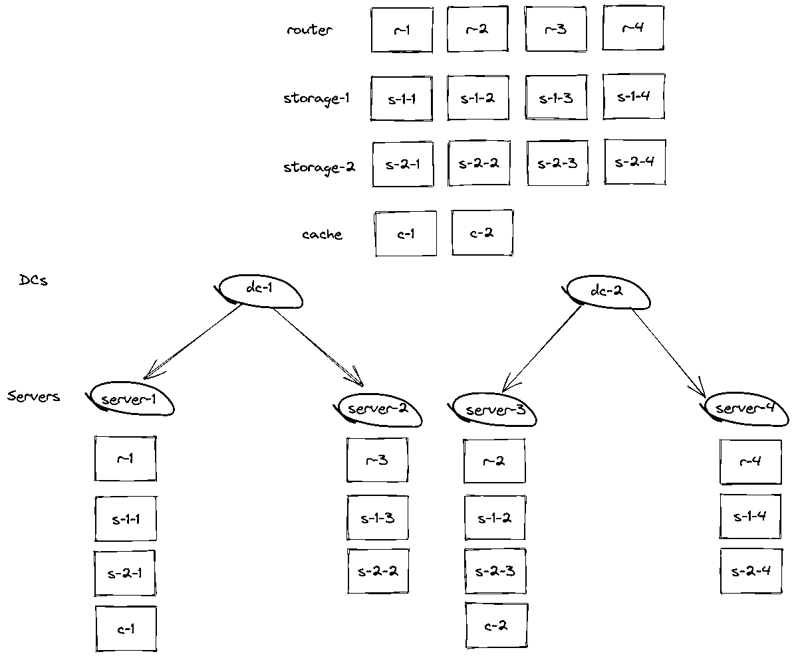
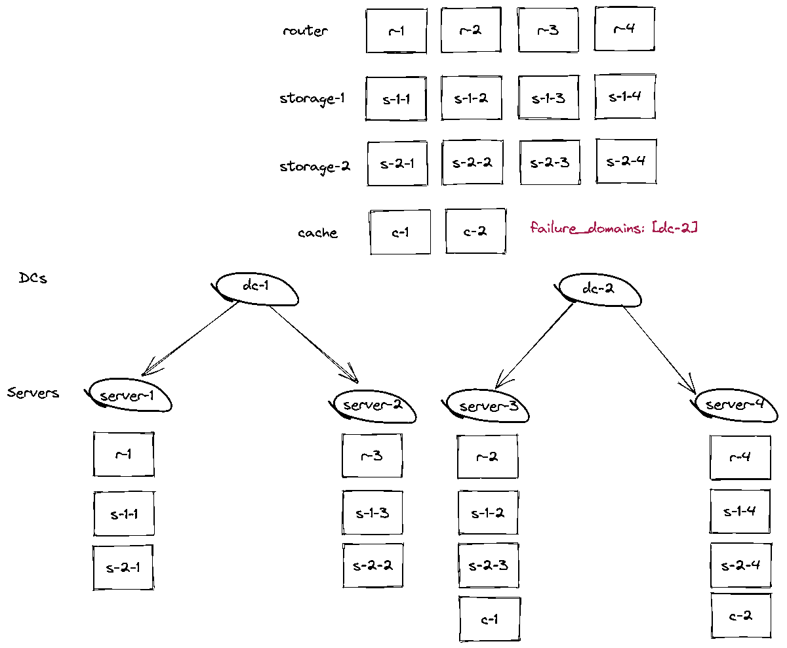

 GENIN
---

[](LICENSE)
[](https://github.com/picodata/genin/blob/master/README.md)
[](https://github.com/picodata/genin/blob/master/README.ru.md)

- [GENIN](#genin)
    * [Что такое генин?](#что-такое-genin)
    * [Установка](#установка)
        - [Linux bin файл](#linux-bin-файл)
        - [RHEL, Fedora, Rockylinux](#rhel-centos-rockylinux-fedora)
        - [Ubuntu](#ubuntu)
        - [Debian](#debian)
        - [macOS](#macosx)
        - [Windows](#windows)
    * [Руководство по использованию](#руководство-по-использованию)
        + [Генерация инвентаря](#генерация-инвентаря)
        + [Редактирование конфигурации кластера](#редактирование-конфигурации-кластера)
          + [Минимальная конфигурация](#минимальная-конфигурация)
          + [Изменение топологии](#изменение-топологии)
          + [Переопределение failover](#переопределение-failover)
          + [Балансировка и управление распределением](#балансировка-и-управление-распределением)
        + [Обратный парсинг](#обратный-парсинг)
        + [Флаги и опции](#флаги-и-опции)
    * [Сборка их исходников](#сборка-из-исходников)
    * [Contributing](#contributing)
    * [Версионирование](#версионирование)
    * [Авторы](#авторство)
    * [Лицензия](#лицензия)
---

## Что такое genin
Genin это генератор инваентаря для `Ansible Cartridge`. Он предназначен для быстрого и
удобного создания инвентарей `tarantool cartridge` кластеров любого размера.
Например инвентарь кластера из 50 репликасетов может легко перевалить за тысячу строк.
В результате чего, любое изменение конфигурации, (например добавление ограничения по памяти
`memtx`) означает довольно большой объем изменений в yaml файле инвентаря и сильно
увеличивает риск ошибок. Genin же позволяет сделать это лишь с помощью изменения
`cluster.genin.yaml` и гарантированно получить тот же самый кластер что был до изменений
но с новой конфигурацией.

## Установка

Genin уже заранее скомпилирован под разные архитектуры и для установки требуется
только скачать бинарный файл, или установить пакет.

#### Linux bin файл

Универсальный исполняемый файл:
```shell
curl -sLO https://binary.picodata.io/repository/raw/genin/bin/genin-0.4.17-x86_64-musl.tar.gz
tar -xvf genin-0.4.17-x86_64-musl.tar.gz ; sudo install genin /usr/local/bin/
```

---

#### RHEL, CentOS, Rockylinux, Fedora

Для операционных систем RHEL, CentOS, Rockylinux and Fedora доступно три вида установки.

1. Установка с помощью пакетного менеджера.

Сначала нужено установить gpg ключ picodata:
```shell
sudo rpm --import https://download.picodata.io/tarantool-picodata/el/RPM-GPG-KEY-kdy
```
После чего можно добавлять репозиторий `picodata-release`.
RHEL 8.x, CentOS 8.x, Rockylinux 8.x, recent Fedora version
```shell
sudo yum install -y https://download.picodata.io/tarantool-picodata/el/8/x86_64/picodata-release-1.1.0.11-1.el8.x86_64.rpm
```
RHEL 7.x, CentOS 7.x
```shell
sudo yum install -y https://download.picodata.io/tarantool-picodata/el/7/x86_64/picodata-release-1.1.0.11-1.el7.x86_64.rpm
```
Обновите метаданные yum.
```shell
sudo yum update
```
Теперь можно запустить установку последней версии genin **Genin**:
```shell
sudo yum install -y genin
```
> **Note:** при таком способе установки вам так же будут доступны все обновления с помощью `yum upgrade genin`

2. Так же вы можете установить пакет `rpm` напрямую без добавления нашего репозитория.
RHEL 8.x, CentOS 8.x, Rockylinux 8.x, recent Fedora version
```shell
sudo rpm -i https://binary.picodata.io/repository/yum/el/8/x86_64/os/genin-0.4.17-1.el8.x86_64.rpm
```
RHEL 7.x, CentOS 7.x
```shell
sudo rpm -i https://binary.picodata.io/repository/yum/el/7/x86_64/os/genin-0.4.17-1.el7.x86_64.rpm
```
> **Note:** будьте внимательны, так как при выборе не правильной версии ос могут быть ошибки
> при установке `rpm`

---

#### Ubuntu

Для установки на `ubuntu` доступен `deb` пакет с `Genin`. Установить пакет
можно двумя способами.
1. Из репозитория `picodata`:
Скачиваем и устанавливаем gpg ключ:
```shell
wget -q -O - https://download.picodata.io/tarantool-picodata/ubuntu/picodata.gpg.key | sudo apt-key add -
```
Добавляем репозиторий:
```shell
sudo add-apt-repository 'deb [arch=amd64] https://download.picodata.io/tarantool-picodata/ubuntu/ focal main'
```
Устанавливаем пакет с `Genin`.
```shell
sudo apt install -y genin
```

2. Загрузкой и установкой пакета напрямую:
```shell
curl -sLO https://binary.picodata.io/repository/raw/genin/deb/genin-0.4.17.amd64.deb && sudo dpkg -i genin-0.4.17.amd64.deb
```

---

#### Debian

Для установки на `debian` доступен `deb` пакет с `Genin`. Установить пакет
можно двумя способами.
1. Из репозитория `picodata`:
   Скачиваем и устанавливаем gpg ключ:
```shell
wget -q -O - https://download.picodata.io/tarantool-picodata/ubuntu/picodata.gpg.key | sudo apt-key add -
```
Добавляем репозиторий:
```shell
sudo add-apt-repository 'deb [arch=amd64] https://download.picodata.io/tarantool-picodata/debian/ bullseye main'
```
Устанавливаем пакет с `Genin`.
```shell
sudo apt install -y genin
```

2. Загрузкой и установкой пакета напрямую:
```shell
curl -sLO https://binary.picodata.io/repository/raw/genin/deb/genin-0.4.17.amd64.deb && sudo dpkg -i genin-0.4.17.amd64.deb
```

---

#### MacOSX
Установка с помощью пакетного менеджера `homebrew` это наиболее простой способ
установки Genin на семейство ОС MacOSX (10.10+). Если это первый продукт `picodata`
который вы платируете использовать то сначала нужно добавить наш `Tap`.
```shell
brew tap picodata/homebrew-tap
```
Теперь можно установить Genin.
```shell
brew install genin
```

Для установки без помощи homebrew используйте следующие команды для загрузки и установки
Genin на macOS (10.10+):
```shell
curl -sLO https://binary.picodata.io/repository/raw/genin/osx/genin-0.4.17-x86_64-macosx.tar.gz
unzip genin-0.4.17-darwin-amd64.zip -d ~/bin/
```

---
> **Note:** Genin будет распакован в директорию `~/bin`. Перед использованием приложения
> пожалуйста удостоверьтесь что `~/bin` добавлена в переменную окружения `$PATH`
---

Если вы хотите установить какую то конкретную версию, то список версий можно посмотреть
с помощью команды:
```shell
brew search genin
```
Установить конкретную версию:
```shell
brew install genin@0.3.8
```

---

#### Windows
Используйте следующие команды для скачивания и установки Genin на операционных системах
Windows 7 64 и новее.
```shell
curl.exe -sLO https://binary.picodata.io/repository/raw/genin/win/genin-0.4.17-win64.zip
unzip.exe genin-0.4.17-win64.zip -d %HOME%/.cargo/bin/
```
> **Note:** Genin будет распакован в директорию `.cargo/bin` которая находится в домашнем
> каталоге важего пользователя. Перед использованием приложения пожалуйста удостоверьтесь
> что `.cargo/bin` добавлена в переменную окружения `%PATH%`.

Для проверки успешнойсти установки вызовите:
```
genin --version
```
Если вы видите сообщение `genin 0.4.17` значит установка прошла успешно.

---
## Руководство по использованию

### Генерация инвентаря

Для начала давайте создадим простой кластер (схожий тому который создается командой
`cartridge create --name my_app`) для виртуального окружения `Vagrant`. Для этого
нам поднадобится `yaml` файл с когфигурацией на основе которой будет работать `Genin`.
Это файл (файл конфигурации `Genin`) задуман как минималистичное описание целевого
инвентаря. Для того что бы постоянно не обращаться к этому readme и не держать возможные
параметры в голове, есть специальная подкоманда которая создаст нам его. Давайте вызовем
ее.
```shell
genin init
```
Команда `genin init` создаст `cluster.genin.yaml` в той же директории в которой была
вызвана.

> **Note:** `Genin` устроен так что если файл `cluster.genin.yml` уже сущесвует (в той
> директории в которой было вызвано приложение, или по целевому пути), тогда файл
> конфигурации будет назван `cluster.genin.copy.yaml`. Команда`genin init` всегда
> будет добавлять суффикс `.copy` в имя файла если файл с целевым именем уже существует.

Так же вы всегда можете указать другое имя или путь файла конфигурации:

```shell
genin init --output mycluster.yml
```

---

> **Note:** Если вы укажете `--output` путь к уже существующему файлу так же будет добавлен
> суфикс `.copy` и файл будет назван `mycluster.copy.yml`.
> Так же для `Genin` расширения `.yml` и `.yaml` эквивалентны.

---

Теперь давайте изучем полученный файл конфигурации.

```yaml
---
# Список репликасетов в виде массива массива, где каждый элемент это репликасет с набором реплик
topolgy:
  # Каждый репликасет это объект (map) в массиве
  - name: router              # (обязательно) имя репликасета
    replicasets_count: 1      # (опционально) как много мастеров нам нужно, по умолчанию 1
    replications_factor: 0    # (опционально) количество реплик в репликасете, для роутера по умолчанию 0
    weight: 10                # (опционально) вес репликасета (не учитывается генином)
    zone: host-1              # (опционально) параметр зоны для ansible cartridge
    roles:                    # (опционально) список ролей в виде массива   
      - router
      - api
      - failover-coordinator
    config:                   # (опционально) конфиг с параметрами для репликасета
      replicaset_name: router # любые значения которые поддерживает ansible cartridge в произвольном порядке

  # Далее будут остальный типы репликасетов
  - name: storage
    type: storage
    replicasets_count: 2      # этот параметр указывает сколько всего будет репликасетов
    replication_factor: 3     # фактор репликации указывает сколько всего инстансов в репликсете
    weight: 10
    roles:
      - storage
    config:
      vshard_group: storage   # (опционально) vshard группа для vshard-storage
      all_rw: true            # (опционально) только чтение
      zone: tokio             # (опционально) зона которую будет учитывать ansible cartridge

# список хостов на который будет устанавливаться кластер
hosts:
  - name: cloud             # (обязательно) имя хоста или домена
                            # в данном примере оба хоста находятся в одном датацентре cloud
    config:                 # (опционально) порты с которых начнется распределение, по умолчанию 8081, 3031
                            # для удобства, что бы не задавать порты для каждого сервера на нижний уровнях
                            # порты можно завать на уровень выше
      http_port: 8081       # (опционально) http порт с которого начнется отсчет портов для инстансов на хостах
      binary_port: 3031     # (опционально) binary порт с которого начнется отсчет портов для инстансов на хостах
    hosts:
      - name: host-1        # внутри указанного выше домена (датацентра) у нас 2 хоста
        config:
          address: 192.168.16.11   # (опционально) адресом может быть IP, url, подсеть (подсеть можно задавать только
                                   # на уровень выше)
      - name: host-2
        config:
          address: host-1.cloud.co

# параметры фейловера
failover:
  mode: stateful                      # (опционально) вариант работы фейловера (stateful, eventual, disabled)
  state_provider: stateboard          # (опционально) провайдер предоставляющий фейловер (stateboard, stateful)
  stateboard_params:                  # (опционально) параметры для провайдера
      uri:
        ip: 192.168.16.1
        port: 4401
      password: "vG?-GG!4sxV8q5:f"

# набор переменных для ansible cartridge
vars:
  ansible_user: my_user
  ansible_password: my_user_password
  cartridge_app_name: my_app
  cartridge_package_path: /tmp/my_app.rpm
  cartridge_cluster_cookie: my_app_cluster_cookie
  # вы можете добавить любое количество переменных необходимыз для целевого инвентаря
```

Замените значение подставленные `Genin` по умолчанию на свои и сохраните файл.
Теперь, когда пройдена уже большая часть пути, остается сгенерировать инвентарь, и создать кластер.
Для инвентаря в `Genin` есть команда `genin build`.

```shell
genin build
```

Готово! Файл `inventory.yaml` будет сгенерирован и сохранен в той же директории где был запущен
`Genin`.
Остается только последний шаг, запустить установку.

```shell
ansible-playbook -i inventory.yaml playbook.yaml
```

---

### Редактирование конфигурации кластера

---

#### Минимальная конфигурация

Для начала давайте посмотрим как выглядел бы файл конфигурации в
минималистичном варианте.

```yaml
---
topology:
  - name: router            # так как для данного репликасета не задано replicasets_count,
                            # а так же не заданы роли, то генин автоматически определит его по имени как
                            # router и установит количество репрлик в репликасете 1 (replication count: 1)
  - name: storage
    replicasets_count: 3
    replication_factor: 2

hosts:
  - name: cloud
    config:
      address: 192.168.12/32
    hosts:
      - name: host-1        # будет автоматически выделен ip 192.168.16.12 из указанной выше подсети
      - name: host-2        # будет автоматически выделен ip 192.168.16.13 из указанной выше подсети
```
Это абсолютно рабочий и валидный файл конфигурации. Все параметры которые мы
не задали (по сравнению с файлом сгенерированным командой `genin init`), будут
заменены дефолтными значениями в процессе генерации инвентаря.

Набор примеров можно найти в директории [docs/examples](docs/examples).

---

#### Изменение топологии

Теперь давайте изменим файл, и расширим наш кластер что бы получился инвентарь более
похожий на настоящий. Для этого мы увеличим количество роутеров хостов, роутеров, стораджей
до 10. Изменим количество реплик у хранилищ (storage) до 1, и добавим кастомный репликасет
`cache` в количестве 5 штук.

```yaml
---
topology:
  - name: router
    replication_factor: 10    # для этого репликасета не заданы роли, а в имени содержится router
                              # поэтому replication_factor для него будут проигнорированы
                              # а количество репликасетов replicasets_count будет установлено по умолчанию 1
  - name: storage
    replicasets_count: 10     # так как количество реплик в репликасете не установлено,
                              # то будет использовано значение по умолчанию
                              # в итоге получится 10 репликасетов с 1 репликой в каждом
  - name: cache
    replicasets_count: 5      # для данного репликасета заданы все основные параметры
    replication_factor: 2     # поэтому генин посчитает что вы знаете что делаете
    roles: [cache, logger]    # и сгенерит 5 репликасетов с 2 репликами в каждом репликасете

hosts:
  - name: cloud
    hosts:
      - name: host-1
        config:
          address: 192.168.16.11      # в этом примере адрес для каждого хоста задан по отдельности
                                      # но для удобства адресс можно было задать подсетью указав
                                      # ее на уровень выше для cloud
      - name: host-2
        config:
          address: 192.168.16.12
      - name: host-3
        config:
          address: 192.168.16.13
      - name: host-4
        config:
          address: 192.168.16.14
      - name: host-5
        config:
          address: 192.168.16.15
      - name: host-6
        config:
          address: 192.168.16.16
      - name: host-7
        config:
          address: 192.168.16.17
      - name: host-8
        config:
          address: 192.168.16.18
      - name: host-9
        config:
          address: 192.168.16.19
      - name: host-10
        config:
          address: 192.168.16.20
```

Количество изменений в конфигурации для `Genin` совсем небольшое по сравнению
с первым примером , а размер итогового `invetory.yaml` для отредактированного
кластера отличается в 5 раз. А теперь попробуйте увличить количество `storage`
до 100шт. Now try increasing the amount of `storage` up to 100pcs.

---

#### Переопределение failover

До текущего момента, наш кластер всегда был со `stateful failover` , теперь
теперь давайте поменяем его на `disabled` и запустим генерацию с командой:
```shell
genin build --failover-state-provider etcd2
```
> **Note:** У всех опций есть короткий вариант, например для провайдера
> фейловера это `genin build -F etcd2`

Этот флаг перезапишет указанный нами в `cluster.genin.yaml` тип фейловера,
и добавит дефолтные значения на основе рекомендуемых для `etcd2`.

Точно так же работают опции связанные с фейловерам и с остальными подкомандами.
```shell
genin init --failover-mode disabled
```
Агрумент `disabled` для `failover-mod` и `failover-state-provider` отключит
фейловер.

Больше о работей фейловера и вохможных вариантах можно узнать в документации
[Tarantool documentation](https://www.tarantool.io/ru/doc/1.10/book/cartridge/topics/failover/).

---

#### Балансировка и управление распределением

По умолчанию `Genin` всегда распеределяет инстансы основываясь на текущей
нагрузке хоста. Например следующая конфигурация для генина будет распределена
следующим образом:
```yaml
---
topology:
  - name: router
    replicasets_count: 4
    roles:
      - router
      - failover-coordinator
  - name: storage
    replicasets_count: 2
    replication_factor: 4
    roles:
      - storage
  - name: cache
    replicasets_count: 2
    roles:
      - cache
hosts:
  - name: dc-1
    hosts:
      - name: server-1
        config:
          address: 192.168.16.11
      - name: server-2
        config:
          address: 192.168.16.12
  - name: dc-2
    hosts:
      - name: server-3
        config:
          address: 192.168.16.13
      - name: server-4
        config:
          address: 192.168.16.14
...
```


Хотя для большинства кластеров автоматического распределения `Genin` должно
быть достаточно, всегда может возникнуть ситуация когда некоторые репликасеты
должны быть распределены на определенный хост или группу хостов. Для этого
в конфигурации `Genin` есть специальная опция `failure_domains`.

```yaml
---
topology:
  - name: router
    replicasets_count: 4
    roles:
      - router
      - failover-coordinator
  - name: storage
    replicasets_count: 2
    replication_factor: 4
    roles:
      - storage
  - name: cache
    replicasets_count: 2
    failure_domains: [dc-2]
    roles:
      - cache
hosts:
  - name: dc-1
    hosts:
      - name: server-1
        config:
          address: 192.168.16.11
      - name: server-2
        config:
          address: 192.168.16.12
  - name: dc-2
    hosts:
      - name: server-3
        config:
          address: 192.168.16.13
      - name: server-4
        config:
          address: 192.168.16.14
...
```
Это заставит Genin распределить репликасет cache следующим образом:



Если указать в `failure_domains` сразу несколько имен хостов
`[ server-2, server-3 ]`, то тогда инстансы репликасета `cache` гарантированно
окажутся на указанных хостах.



---
#### Использование `failure_domain` в качестве параметра `zone` инстансов

`Genin` предоставляет функциональность `failure_domains`, описанную в предыдущем параграфе. В результате его работы, инстансы распределяются по нужным хостам с учетом параметров `failure_domains` в их конфигурации.

Есть возможность использовать финальный хост (конкретный `failure_domain`, куда распределяется инстанс) в качестве параметра [`zone`](https://github.com/tarantool/ansible-cartridge/blob/master/doc/variables.md?plain=1#L90) в ansible-конфигурации инстанса. Для этого необходимо передать флаг `--fd-as-zone` в команду `build`, например: `genin build --fd-as-zone`.

Точное поведение `Genin` при передаче этого флага будет следующим:

0. После работы стандартного алгоритма `failure_domains`, инстансы будут распределены на некоторые хосты согласно их конфигурации;
1. Имя итогового хоста, на который был распределен инстанс, будет использовано в качестве параметра `zone` в ansible-конфигурации инстанса.

---

### Обратный парсинг

Так как `Genin` это относительно свежий инструмент, и в `picodata` далеко не все
кластеры `tarantool` были сгенерированы с помощью него, то для упрощения
перехода существует команда `reverse`.

```shell
genin reverse -s inventory.yml -o cluster.genin.yml
```

Эта команда позволяет распарсить уже готовый инвентарь и получить конфигурацию
`cluster.genin.yml` для `genin build`.
Для чего это может быть нужно? Например для команды `upgrade`. Которая служит
для добавления новых репликасетов или инстансов и требует 2 файла конфигурации.

У команды `reverse` есть несколько важных особенностей работы:
1. Так как инвентарь представляет из себя плоский список, без разделения по
доменам, датацентрам, регионам то `genin` не может ничего знать о структуре и
сгенерирует конфигурацию тоже плоской.

Например если пройти цикл, то мы потеряем всю информацию о `failure` доменах:
```shell
genin init -o cluster.genin.yml
genin build -s cluster.genin.yml -o inventory.yml
genin reverse -o inventory.yml
```

Последняя команда, вызов `reserve`, отобразит таблицу без доменов.
```text
+-------------+-------------+
|          cluster          |
+-------------+-------------+
|  server-1   |  server-2   |
+-------------+-------------+
| router-1-1  | storage-1-1 |
| 8081 8081   | 8081 8081   |
+-------------+-------------+
| storage-1-2 | storage-2-1 |
| 8082 8082   | 8082 8082   |
+-------------+-------------+
| storage-2-2 |             |
| 8083 8083   |             |
+-------------+-------------+
```

2. Полученный в с помощью `reverse` файл конфигурации будет так же иметь
несколько другую конфигурацию.

```yaml
---
topology:
  - name: router
    replicasets_count: 1
    replication_factor: 1
    roles:
      - router
      - failover-coordinator
    config:
      http_port: 8081
      binary_port: 8081
      address: 192.168.16.11
  - name: storage
    replicasets_count: 2
    replication_factor: 2
    roles:
      - storage
    config:
      http_port: 8082
      binary_port: 8082
      address: 192.168.16.11
hosts:
  - name: server-1
    config:
      address: 192.168.16.11
  - name: server-2
    config:
      address: 192.168.16.12
failover:
  mode: stateful
  state_provider: stateboard
  stateboard_params:
    uri: "192.168.16.11:4401"
    password: password
vars:
  ansible_user: ansible
  ansible_password: ansible
  cartridge_app_name: myapp
  cartridge_cluster_cookie: myapp-cookie
  cartridge_package_path: /tmp/myapp.rpm
  cartridge_bootstrap_vshard: true
```

---

#### Реконфигурация кластера

Для обновления кластера развернутого с помощью сгенерированного `Genin`
инвентаря, существует специальная команда `upgrade`, предназначенная для
добавления новых инстансов. В отличии от повторной генерации инвентаря, при
которой все инстансы перераспределяются каждый раз заново, `upgrade` оставит
распределение как есть, и лишь добавит новыеинстансы. Это позволит
безболезненно обновить кластер, без полного редеплоя.

Для запуска `upgrade` нужно передать два обязательных оргумента `--old`
и `--new`.
```shell
genin upgrade --old cluster.genin.yml --new upgrade.genin.yml -o inventory.yml
```

Опция `--old` указазывает путь к старому конфигу кластера которому мы хотим
сделать `upgrade`.  
Опция `--new` путь к новой конфигурации кластера, на основе которой `Genin`
сделает `diff` и добавит те инстансы которых не было в конфиге переданном в
`--old`.

| Old                                                                       | New                                                                       | Diff                                                          |
|---------------------------------------------------------------------------|---------------------------------------------------------------------------|---------------------------------------------------------------|
| <pre>- name: router<br/>  replicasets_count: 2                            | <pre>- name: router<br>  replicasets_count: 4                             | <pre>router-3<br>router-4                                     |
| <pre>- name: storage<br>  replicasets_count: 2<br>  replication_factor: 2 | <pre>- name: storage<br>  replicasets_count: 2<br>  replication_factor: 4 | <pre>storage-1-3<br>storage-1-4<br>storage-2-3<br>storage-2-4 |

---

> **Note:** на текущий момент, `downgrade` кластера реализован лишь частично
> и требует ручной проверки полученного в итоге инвентаря.

---

### Флаги и опции

В этом параграфе мы рассмотрим несколько полезных флагов и опций которые могут
пригодиться при использовании `Genin`.
Как до этого всколько упоминалось, всегда можно задавать исходный и целевой путь
для генерации. Путь может быть как относительным так и асболютным.
```shell
genin init --output /home/tarantool/custom_cluster_name.yml
genin show --source /home/tarantool/custom_cluster_name.yml
genin build --source /home/user/path/my_cluster.genin.yml --output /home/tarantool/cluster-new/my_hosts.yml
genin build -s /home/user/path/my_cluster.genin.yml -o /home/tarantool/cluster-new/my_hosts.yml
```
> **Note:** Стоит еще раз повторить, что в случае вызова любой из подкоманд
> `build`, `init` и т.д. `Genin` будет искать файлы с названиями по умолчанию
> (такими как cluster.genin.yaml, inventory.yaml)

Так же вы можете задать количество выводимой информации (например о механизме
распределения), с помощью опции `verbosity`.
```
genin build -vvv
```

---

> **Note** Количетво выводимой информации повышается с добавлением новых
> вхождений `-v`. Например `-vv` будет эквивалентно уровню *TRACE*

---

Для управления форматом отображения схемы существует опция `--scheme`
(короткий вариант -p) которая принимаем последовательность символов эквивалетных
опциям отображения.

// Таблица символов в разработке

Кроме того, для передачи чувствительной информации существуют флаги
```shell
genin build --ansible-user dmitry.travyan --ansible-password ddfqd
genin build --cartridge-cluster-cookie R68sJfV4C2hLrWC3
```

Как было сказано ранее, по умолчанию `Genin` будет создавать копии файлов, если по
указанному пути уже существует целевой файл. Для того что бы принудительно
перезаписать целевой файл, существует флаг `--force` (или короткий `-f`).
```shell
genin build -o my-cluster.yml
genin build -o my-cluster.yml --force
```

## Сборка из исходников

Первым делом устанавливаем язык программироования `Rust`.
```shell
curl --proto '=https' --tlsv1.2 -sSf https://sh.rustup.rs | sh
```

---

> **Note:** После установки убедитесь что у вас обновились переменые пути (`$PATH`,
> `%PATH%`) иначе вы получите ошибку при вызове исполняемых файлов комплятора `Rust`.

---

Следующий щаг это клонирование репозитория с исходным кодом.
```shell
git clone https://github.com/picodata/genin.git
```

Переходим в директорию `Genin` переключаемся на `nightly` версию `Rust`.
```shell
cd genin
rustup override set nightly
```

А затем компилируем и устанавливаем к себе в исполняемы файлы `cargo` бинарный
получившийся бинарный файл файл.
```shell
cargo +nightly build --release
install -m 001 target/release/genin /usr/local/bin/
```

> **Note:** Возможно при сборке из исходников, вам понадобятся какие либо
> дополнительные инструменты. На всякий случай ниже приведены потенциальные варианты
> пакетов которых может не хватать.
>
> Для дистрибутивов основанных на debian:
> ```shell
> sudo apt install -y build-essential
> ```
> Для rhel подобных дистрибутивов (RHEL, CentOS, Rockylinux, Fedora):
> ```
> sudo yum install -y gcc
> ```
> Для MacOSX возможно могут понадобиться `Command Line Developer Tools`
> проверить их установку можно вызвав `xcode-select --install`.

Проверяем корректность сборки и установки вызововм опции `--version`
```shell
genin --version
```

## Contributing

Приветствуются любые pull requests. Для масштабных изменений пожалуйста предварительно
откройте issue и опишите изменения которых вы хотите внести.

## Версионирование

Для версионирования используется соглашение [SemVer](http://semver.org/). Выход
релизов определяется с помощью тегов на HEAD ветки вносящей изменения.
Список версий смотрите в [тегах репозитория](https://github.com/picodata/genin/tags).

## Авторство

- **Dmitry Travyan**
- **Lomakina Anastasia**

© 2020-2022 Picodata.io https://github.com/picodata

## Лицензия

Этот проект распостраняется под лицензией BSD-2. Подробнее в файле линеции [LICENSE](LICENSE).
