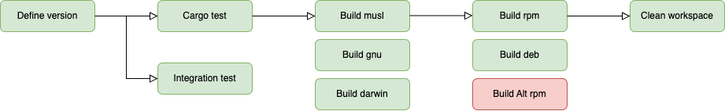
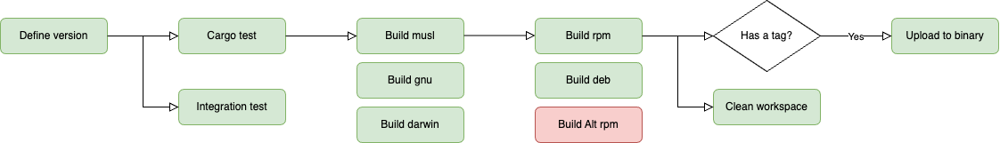
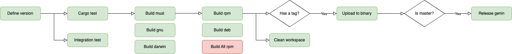

# Genin releases

## Системы основанные на Debian и Rhel

CI `Genin` представляет из себя следующие последовательности `Github actions`.

Тесты и сборка без тега:


Тесты и сборка с тегом в любых ветках кроме мастера:


Тесты и сборка с тегом в мастере:


В процессе `ci` последовательно выполняется тестирование, запуск линтера, сборка
исполяемого файла под MacOS и основные дистибутивы линукс. Так же `ci` содержит 
ряд условий на основе которых процесс выпуска новых релизов `Genin` происходит 
автоматически при пуше тега.

### Порядок действий при релизе
1. Создать ветку и запушить ее.
2. Если `ci` прошел успешно (тесты выполнись без замечаний), то открываем `Pull 
Request` в мастер.
3. Теперь необходимо поднять версию в файлах `Cargo.toml`, `README.ru.md`, `README.md`
и запушить изменения.
4. Если `ci` прошел успешно, то ставим тег в ветки и пушим тег.
5. После сборки и тестирования, `ci` автоматически запушит версию с тегом в [binary.picodata.io](https://binary.picodata.io/#browse/browse:bastida-raw:genin). 
Запушенные пакеты (а так же исполняемый файл) будут иметь приписку `~rc`, например 
`0.5.0~rc`. Это необходимо для того что бы отделять версии из пулл реквестов от 
релизных.
6. Если патч готов к релизу, то ревьюим `Pull Request` и мерджим в мастер. После 
того как `ci` успешно завершится, мы получим новый релиз в гитхабе, а так же набор
пакетов не только [binary.picodata.io](https://binary.picodata.io/#browse/browse:bastida-raw:genin), 
но и в [download.picodata.io](https://download.picodata.io/tarantool-picodata/).

## MacOS

Для `MacOS` версии 10.10+ при релизе требуется несколько дополнительных действий. 
Все дело в том, что релизы в `homebrew` тяжело автоматизировать так как они требуют 
редактирования скриптов написанных на `Ruby`.

### Порядок действий при релизе

1. После того как патч с тегом влит в мастер и на GitHub появился новый релиз, 
переходим в репозиторий [picodata homebrew tap](https://github.com/picodata/homebrew-tap) и создаем новую ветку
в которой будет наша новая версия `Genin`.
2. Вычисляем хэшсумму `sha256` от архива с исполняемым файлом `shasum -a 256 genin-0.5.3-x86_64-macosx.tar.gz`.
3. Создаем файл `Formula/genin@0.5.5.rb`. Файл должен содаржать в названии версию Genin 
записанную через символ `@`.
```ruby
# В название добавляем версию. Например версия 0.5.5 должна быть записана как AT055
class GeninAT055 < Formula
  desc "Quick inventory generation for tarantool apps"
  homepage "https://github.com/picodata/genin"
  # Меняем версию или полный путь к пакету в binary.picodata.io
  url "https://binary.picodata.io/repository/raw/genin/osx/genin-0.5.5-x86_64-macosx.tar.gz"
  # Вставляем хэшсумму вычисленную в шаге 2
  sha256 "cf09eab628a179ccc3f548bc7b4fcfa0e4defa2ef373913a7e89dca25a65556e"
  # Меняем версию
  version "0.5.5"
  license "BSD-2-Clause license"

  def install
    bin.install "genin"
  end

  test do
    system "#{bin}/genin"
  end
end
```
4. Обновляем симлинк в директории Alias на актуальную версию.
5. Открываем Pull Request в мастер и мерджим обновленную формулу.

> **Note:** обновление версии без поднятия хотя бы минорной части приведет к конфликту 
> версий в Homebrew Tap. Поэтому рекомендуем всегда поднимать версию генина вне 
> зависимости от объема привносимой функциональности.
